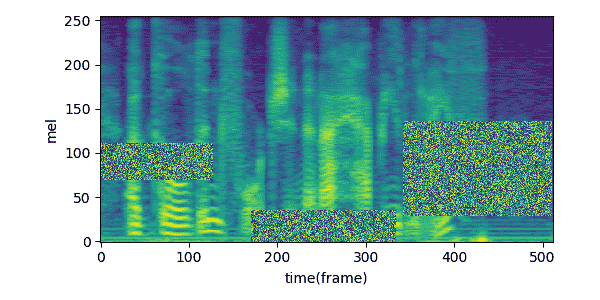
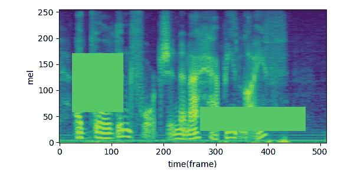
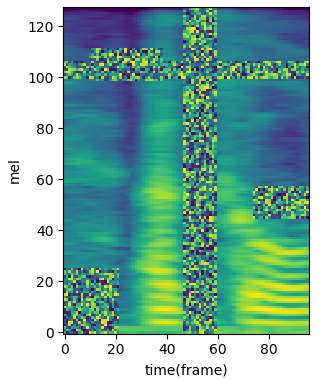

[]()


<table align="center"><tr><td align="center" width="9999">

# Spec-augment-chain GPU
Flexible Augmentation Pipeline for Audio Spectrogram
</table>

## Key features
* build your flexible chain with CutOut and SpecAugment 
* working as an augmentation layer with probability
* working standalone as a pre-processor in data pipeline
* n-cutout: can create multiple holes
* vertical: temporal masking
* horizontal: frequency masking

## Installation
* Basically nothing is required other than [Tensorflow](https://www.tensorflow.org/)
* The example codes require [librosa](https://github.com/librosa/librosa)

## Quick start
```python
from specaug_chain import SpecAugChainer
spec_aug_chainer = SpecAugChainer(chain_config=['cutout', 'vertical', 'horizontal'],
                                  probs=0.5, uniform_mask=True,
                                  n_holes=3, hole_fill='random') # hole_fill='zeros' or 'min'    
spec_aug_chainer.trainable = False # Make sure of this                           
m = (your method to get spectrogram here... m should be <tf.Tensor>)
m_aug = spec_aug_chainer(m)
display_spec(m_aug[0,:,:,0].numpy())

# To bypass augmentor:
spec_aug_chainer.bypass = True # False by default.
```

| n_holes=3, hole_fill='random' | n_holes=2, hole_fill='zeros' |
| :---: | :---: |
| | |

| chain_config=['cutout', 'vertical', 'horizontal'], n_holes=2, hole_fill='random' |
| :---: |
| |

## Speed
* `uniform_mask` = True: with input shape of 128 x 256 x 512 x 1 (B,W,H,C), applying 3-cutout augmentation takes less than 5 ms in Titan X GPU.  
* `uniform_mask` = False: 359 ms
